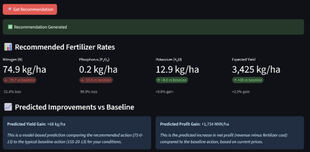

# Fertilizer Advisor

## Causal machine learning for fertilizer recommendations

An offline contextual-bandit research project and bilingual decision-support prototype for maize production in Chiapas, Mexico. The project uses historical field data to learn fertilizer recommendations that account for differences in soil, weather, and management conditions, and evaluates their expected economic performance before prospective field testing.

[Explore the app](https://fertilizer-advisor-ndwdrwk9r6jvjyf2cwxqv6.streamlit.app/) · [Read the doctoral praxis](docs/paper.pdf) · [Project page](https://danrdoran.github.io/Fertilizer-Advisor/)

The central question is economic as well as agronomic: **which historically supported fertilizer combination offers the highest expected profit for a particular field, rather than simply the highest predicted yield?**

This is a research prototype. Reported policy gains are estimates from historical observational data, not realized gains from a prospective deployment or randomized field trial.

## Application preview

[](https://fertilizer-advisor-ndwdrwk9r6jvjyf2cwxqv6.streamlit.app/)

_Example output. The displayed gains are model-based predictions relative to the modal supported baseline action for the entered conditions, not field-validated effects._

## Data and sources

The analysis uses **4,585 maize field-season observations from Chiapas, Mexico, covering 2012–2018**, collected through CIMMYT's on-farm research and extension activities. The accompanying dataset article is [Trevisan et al. (2022), Multiyear Maize Management Dataset collected in Chiapas, Mexico](https://doi.org/10.1016/j.dib.2022.107837).

- **Agronomic records:** yield, fertilizer application, planting date, cropping system, and tillage. The source workbook is `data/chiapas_maize.xlsx`; its `Legend` sheet describes variables and units.
- **Environmental context:** location, topography, soil characteristics, and weather. The workbook identifies INEGI soil data and DAYMET weather inputs.
- **Model inputs:** 40 processed context features, including weather summaries from six pre-plant windows, V1–V6. Municipal average yield and post-plant weather are excluded from the context features to avoid using outcome-related or post-decision information.
- **Actions and outcome:** fertilizer rates are expressed as kg/ha of N, P₂O₅, and K₂O. These are nutrient rates, not commercial fertilizer-product weights. Source yield in tonnes/ha is converted to kg/ha.

The document assistant uses INIFAP's _Agenda Técnica Agrícola de Chiapas_ (2017), provided in `docs/agenda-tecnica-chiapas.pdf`, as a separate source of maize-management guidance. It is not the source of the model's numerical yield estimates.

## Methodology

1. **Construct pre-plant context features.** Combine location, soils, planting timing, pre-plant weather, cropping system, and tillage, while keeping fertilizer actions separate from the context matrix.
2. **Discretize fertilizer actions.** Learn adaptive nutrient bins from prior training years, with up to six N bins, three P₂O₅ bins, and two K₂O bins: a joint grid of up to 36 actions.
3. **Model outcomes and historical decisions.** Use stacked XGBoost, LightGBM, and CatBoost regressors with a RidgeCV meta-learner, alongside a joint behavior-policy model. The research evaluation models profit and uses an auxiliary yield model to report agronomic outcomes under the profit-oriented policy.
4. **Construct a support-aware policy.** Restrict recommendations using historical action counts, on-support exploration, and SPIBB-inspired fallback rules. The reported selected specification uses ε = 0.10, λ = 0.00, a 30-observation support threshold, and a 60-observation threshold for deviations from the baseline.
5. **Evaluate retrospectively.** Estimate policy performance with doubly robust (DR) and self-normalized doubly robust (SNDR) estimators, overlap trimming, Pareto-smoothed importance sampling (PSIS), and 1,000 spatial cluster-bootstrap replicates.

The research evaluates years **2013–2018**, with 2012 providing initial historical training data. Bins and support counts are learned from years before the evaluation year. As described in the praxis and manuscript, retrospective site-based cross-fitting can fit models using those earlier years **plus other site folds from the evaluation year**, while holding out the scored fold. This is not a strictly prospective, past-years-only deployment test.

### Economic objective

Following the terminology of the praxis and manuscript, **profit** means maize revenue minus fertilizer costs:

`profit (MXN/ha) = 3.5 × yield (kg/ha) − 16 × N − 12 × P₂O₅ − 8 × K₂O`

Nutrient quantities are in kg/ha. The research holds these prices fixed across years: maize at MXN 3.5/kg, N at MXN 16/kg, P₂O₅ at MXN 12/kg, and K₂O at MXN 8/kg. Other production costs are not included, so this is not a complete farm-income account. The app expresses maize price per tonne; MXN 3,500/tonne is equivalent to MXN 3.5/kg.

## Reported research findings

The following results are reported in the **doctoral praxis, Table 4-3 and Sections 4.5–4.6**, and the associated **journal manuscript, Table IV and Sections III.D–III.E**. They refer to the overlap-trimmed evaluation population and the research price assumptions.

| Estimator | Estimated profit gain, MXN/ha (95% CI) | Estimated yield gain, kg/ha (95% CI) |
| --------- | -------------------------------------: | -----------------------------------: |
| DR        |                    +619 (+455 to +771) |                  +209 (+157 to +256) |
| SNDR      |                    +582 (+407 to +776) |                  +199 (+144 to +259) |

- **Positive average estimated gains:** the SNDR result corresponds to approximately **5.7% higher profit** and **5.5% higher yield** relative to the research baseline.
- **Important seasonal differences:** SNDR profit estimates are negative in 2013 and approximately flat in 2015, but positive in 2014, 2016, 2017, and 2018. Higher yield does not necessarily offset additional fertilizer expenditure.
- **Nutrient rebalancing rather than a universal reduction:** the policy increases P₂O₅ and K₂O in several seasons while reducing N in 2016 and 2018. Averaged across evaluation years, reported changes are positive for all three nutrients; the study does not establish a general reduction in total fertilizer use.

The overlap subset contains **2,752 of 3,862 evaluation observations**, approximately **71%**. The reported Pareto-tail diagnostic is **k̂ = 0.63** on that subset, compared with 1.36 before trimming. These results should not be generalized to unsupported observations, other crops, or other regions without further validation.

## Decision-support application

The English/Spanish Streamlit app accepts pre-plant field conditions and prices, returns N–P₂O₅–K₂O recommendations, and displays predicted yield and profit comparisons. Its reference action is the **modal supported action** of the estimated historical behavior policy for the entered context. That single-action display comparison is distinct from the policy-value comparison used in the research results above.

The app uses ε = 0.10 and λ = 0.00, projects recommendation probabilities using its SPIBB-style count rules, and samples an action with a baseline fallback. It also displays nutrient-limit warnings. Historical support indicators describe data coverage; they are not statistical confidence intervals or guarantees of field performance.

The “Consult Technical Documentation” feature retrieves passages from INIFAP guidance and generates page-cited responses. Numerical recommendations come from the application's model-and-policy workflow; the language model provides supporting explanations. Changing prices may change the recommended action and does not transfer the original offline performance estimates to the new price scenario.

## Run the existing app

The repository includes model and processed-data artifacts; retraining is not required to try the application. Run commands from the repository root.

```bash
git clone https://github.com/danrdoran/Fertilizer-Advisor.git
cd Fertilizer-Advisor
```

Create a local `.env` file containing your own API key:

```dotenv
OPENAI_API_KEY=your_api_key_here
```

Do not commit this file or a real key. The current app requires `OPENAI_API_KEY` because it initializes the document-assistant component. API usage may incur charges, and questions and retrieved passages are sent to the API provider.

```bash
docker build -t fertilizer-advisor .
docker run --rm -p 127.0.0.1:8501:8501 --env-file .env fertilizer-advisor
```

Open [localhost:8501](http://localhost:8501). The app's default 2019 scenario is illustrative; 2019 is not an observed evaluation year in the research dataset.

## Research entry points

These are the current script locations. Names such as `preprocess.py`, `core.py`, `ope.py`, and `app.py` in the manuscript correspond to the respective roles below; they are not the current filenames. The manuscript also mentions `diagnostics.py`, which is not present as a standalone script in this snapshot.

| File                                   | Role                                                                      |
| -------------------------------------- | ------------------------------------------------------------------------- |
| `scripts/preprocess_data.py`           | Build processed context features, actions, yield, and metadata            |
| `scripts/bandit_models.py`             | Shared binning, outcome-model, propensity-model, and diagnostic utilities |
| `scripts/train_models.py`              | Train serialized models and generate training/holdout diagnostics         |
| `scripts/learn_and_evaluate_policy.py` | Run by-year and pooled offline policy evaluation                          |
| `scripts/fertilizer_advisor_app.py`    | Bilingual recommendation interface                                        |
| `scripts/rag_faiss.py`                 | PDF retrieval and document-assistant utilities                            |

### Optional local training and evaluation

Use a separate working copy for experiments. Python 3.12 matches the Docker base image. A frozen research environment and a table-by-table reproduction record are not yet included; the reported findings above should not be interpreted as a claim that a fresh run of this snapshot reproduces every manuscript table.

```bash
python -m venv .venv
source .venv/bin/activate
python -m pip install -r requirements.txt

python scripts/preprocess_data.py

python scripts/train_models.py \
  --data data/processed/processed_data.npz \
  --features data/processed/feature_cols.csv \
  --output_dir results/local_training \
  --n_trials 4 \
  --recency_lambda 0.10 \
  --start_val_year 2014 \
  --end_val_year 2017 \
  --holdout_year 2018
```

The activation command above is for Bash. The output directory keeps newly trained models separate from the bundled app artifacts. This standalone training configuration fits through 2017 and holds out 2018; it is distinct from the retrospective by-year OPE procedure. The legacy `--n_trials` argument is retained for CLI compatibility; the current model implementation does not use it to perform a hyperparameter search.

**PSIS prerequisite:** the current `requirements.txt` does not list ArviZ, although the evaluation script uses it. Before attempting a PSIS run, verify ArviZ and the estimator configuration against the original experiment environment. Do not interpret the script's fallback without ArviZ as PSIS evaluation. The DR weight-normalization path also requires reconciliation before claiming exact reproduction of the reported DR results.

The following documents the existing profit-policy configuration; it is not a substitute for that reproducibility check:

```bash
python scripts/learn_and_evaluate_policy.py \
  --data data/processed/processed_data.npz \
  --objective profit \
  --maize_price 3.5 --priceN 16 --priceP 12 --priceK 8 \
  --trim_enable \
  --trim_pi0_tau 0.01 \
  --trim_ratio_max 10 \
  --trim_min_count_logged 30 \
  --trim_min_count_target 30 \
  --spibb_min_deviation_count 60 \
  --epsilon_explore 0.1 \
  --lambda_mix 0.0 \
  --cohort overlap \
  --weights psis \
  --recency_lambda 0.10 \
  --cf_k 5 \
  --alpha 0.05 \
  --n_bootstrap 1000 \
  --out_weights_csv results/weights_all.csv \
  --out_json results/ope_by_year_result.json \
  --out_csv results/ope_by_year_summary.csv \
  --by_year_csv results/ope_by_year.csv \
  --out_policy_csv results/ope_by_year_policy_rows.csv
```

## Limitations and interpretation

The causal interpretation depends on consistency, conditional exchangeability given the observed context, and positivity within the retained overlap population. Observational fertilizer choices may remain confounded by unmeasured management, input access, pests, or expectations. Doubly robust estimation does not remove unmeasured confounding.

The study uses fixed prices, one fertilizer-regime decision per field-season, and data from one region and period. Bootstrap intervals quantify spatial cluster-sampling uncertainty conditional on the fitted models and selected policy. Prospective agronomic trials and stakeholder usability testing remain necessary before real-world deployment. Environmental benefits are not directly measured here.

## Research documents and attribution

- **Doctoral praxis:** Daniel Doran, _Causal Machine Learning for Fertilizer Recommendations: Contextual Bandit Policy Improves Profit in Offline Evaluation_. The George Washington University, 2026. [Read the praxis](docs/paper.pdf).
- **Journal manuscript:** Daniel Doran and Haya Shajaiah, _Causal Machine Learning for Fertilizer Recommendations: Contextual Bandit Policy Increases Profit in Offline Evaluation_. Submitted to IEEE Access.
- **Dataset:** Trevisan et al. (2022), _Data in Brief_, 40, 107837. [Dataset article](https://doi.org/10.1016/j.dib.2022.107837).
- **Technical guidance:** INIFAP, _Agenda Técnica Agrícola de Chiapas_ (2017). [Local reference document](docs/agenda-tecnica-chiapas.pdf).

The dataset and third-party technical guidance remain subject to their respective source terms and attribution requirements.
